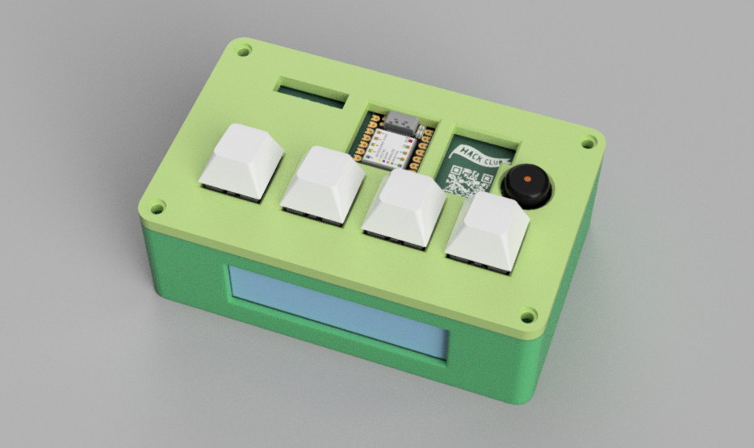
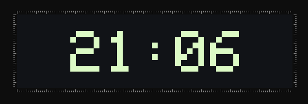
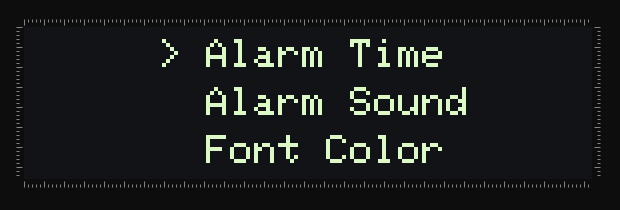
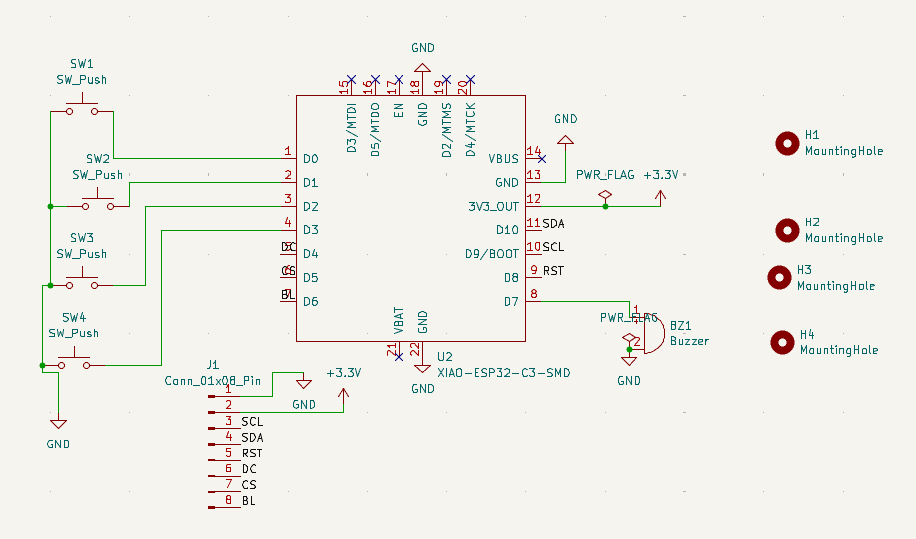
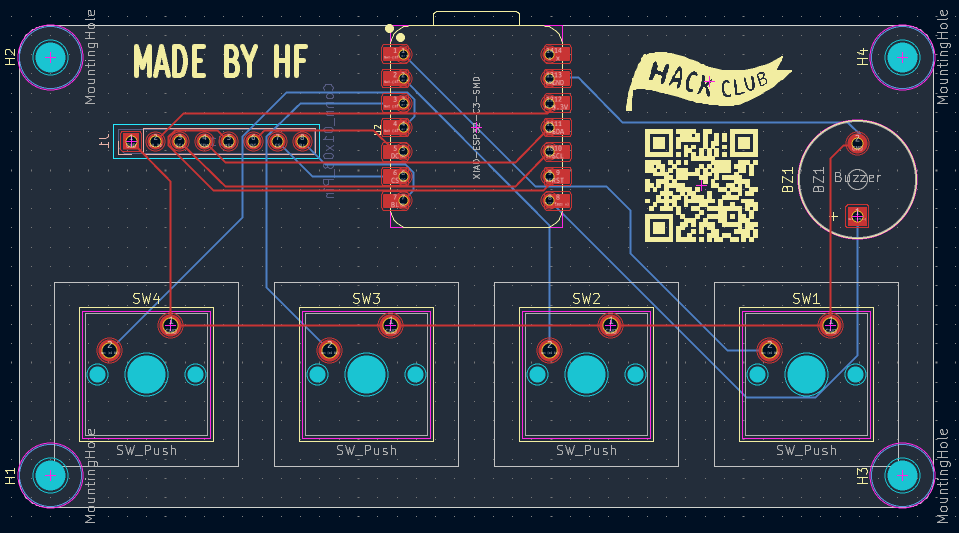
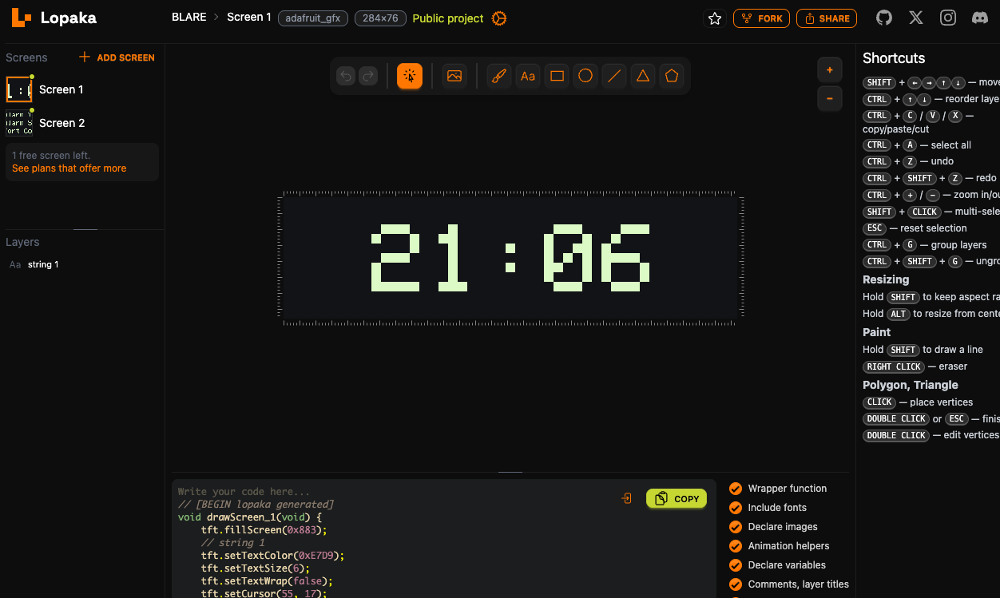

# BLARE Alarm Clock

This is my custom alarm clock built using a Seeed XIAO ESP32C3 as the brain, with a customizable menu system, real-time clock over wifi, and public domain alarm melodies (Fur Elise, Mountain King, Reveille) played using a passive buzzer.



## Features

* RTC using Wi-Fi (NTP)
* Adjustable alarm time
* Changeable alarm sounds
* Adjustable font color
* Button-controlled UI
*  2.25in TFT Screen

## UI

The UI is designed using simple menus so it's easier to navigate using only four buttons (enter, back, up, down). 


The Home screen displays the current time.



The Settings menu currently has:

* Alarm Time
* Alarm Sound
* Font Color



## How It Works

The clock is controlled by a Seeed XIAO ESP32C3. On startup, it connects to the wifi and get the current time through NTP, since I couldn't use an RTC module (all available GPIO pins were already being used). The current time is displayed on the Home screen, and the user can set the alarm time through the Settings menu. When the current time is the same as the alarm time, the selected melody is played using the piezo buzzer.

## Hardware

The current hardware includes the following components:

* Seeed XIAO ESP32C3
* 2.25in TFT Screen (ST7789 driver)
* 4 pushbuttons
* Passive piezo buzzer

## Schematic & Hardware Wiring

The board uses the XIAO ESP32-C3's D0–D10 pins for all peripherals:

* D0–D3: pushbuttons (enter, back, up, down)
* D4–D6, D8–D10: TFT screen (DC, CS, BL, RST, SCL, SDA)
* D7: buzzer

All 11 available GPIOs are used, leaving no free pins for other components such as an RTC module.



The PCB was designed in KiCad, with the four pushbuttons placed alongside the screen for easy access.



## Project Structure

```text
BLARE/
├── main.ino
└── wifi_codes.h
```

## Current Status

The project is still in the making process.

What I've done so far:

* Basic TFT interface
* Home screen with live clock
* Menu navigation
* Settings screen
* Alarm time adjustment
* Font color adjustment
* Alarm sound selection
* Time sync over wifi
* Alarm trigger logic
* Snooze/dismiss handling

I have left to do:

* Hardware testing on the assembled PCB

## Design

The UI layout was designed using **lopaka.app**, an online graphic design tool for microcontroller screens, before being integrated into the Arduino sketch.



## Built With

* Arduino (C++)
* ESP32
* Adafruit_GFX / Adafruit_ST7789 (Arduino Libraries)
* lopaka.app
* KiCad

## AI Usage

I used AI, mainly for:

- Code debugging: fixing errors and syntax issues.
- Alarm sounds: adding public domain melodies (Für Elise, Reveille, In the Hall of the Mountain King) to play through the buzzer.

The actual project design, schematic, PCB layout, UI design, and final assembly were done by me.

---
**Made by Harry Fanouriakis**
